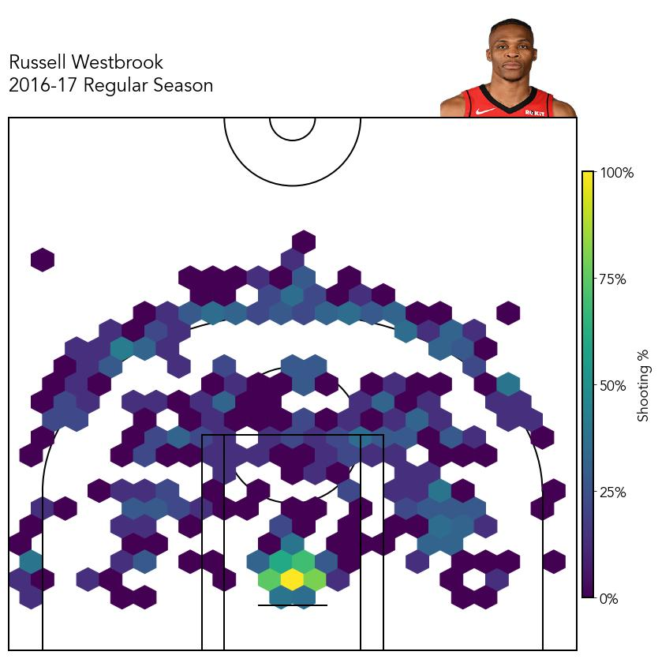

<h3 align="center">NBA Shot Chart</h3>

  

    TODO - Add Project Description
  

<!-- TABLE OF CONTENTS -->

  
Table of Contents

  <ul>
    <li>
      <a href="#about-the-project">About The Project</a>
      <ul>
        <li><a href="#built-with">Built With</a></li>
      </ul>
    </li>
    <li>
      <a href="#getting-started">Getting Started</a>
      <ul>
        <li><a href="#prerequisites">Prerequisites</a></li>
        <li><a href="#installation">Installation</a></li>
      </ul>
    </li>
    <li><a href="#usage">Usage</a></li>
    <li><a href="#roadmap">Roadmap</a></li>
    <li><a href="#contact">Contact</a></li>
    <li><a href="#acknowledgments">Acknowledgments</a></li>
  </ul>

<!-- ABOUT THE PROJECT -->
## About the Project
This project is an extension of previous work by others, combining things from each project that I personally loved and removes some that I did not (see the [Acknowledgements](#Acknowledgements) section for more info). 

(<a href="#top">back to top</a>)

### Built With
* [Python](https://www.python.org)
* [Jupyter](https://jupyter.org)

(<a href="#top">back to top</a>)

<!-- GETTING STARTED -->
## Getting Started

TODO

(<a href="#top">back to top</a>)

### Prerequisites

TODO

(<a href="#top">back to top</a>)

### Installation

TODO

(<a href="#top">back to top</a>)

<!-- USAGE EXAMPLES -->
## Usage
In the project's current state, there are variables to be set to generate the image. Right now, these variables are hardcoded python values, named:

* `player_first_name`
* `player_last_name`
* `team_name`
* `player_season`
* `season_type`

An example, seen in the populated Jupyter Notebook, generates a short chart like:

See the [Roadmap](#Roadmap) section for information on how this process will change over time.

(<a href="#top">back to top</a>)

## Roadmap
- [] Add a form for information input.
  - [] Hide code in Jupyter notebook when using form.
- [] Update with better input validation for player's first and last name.
- [] Adding download support for the image.
- [] Add support for different color schemes.
- [] Add support for teams.
  
  
(<a href="#top">back to top</a>)

<!-- CONTACT -->
## Contact

Mitchell Jones - [@mitch3lljones](https://twitter.com/mitch3lljones)

(<a href="#top">back to top</a>)

<!-- ACKNOWLEDGMENTS -->
## Acknowledgements

* [Savvas Tjortjoglou](http://www.savvastjortjoglou.com/)
* [Peter Beshai (Buckets)](http://buckets.peterbeshai.com/app/#/playerView/201935_2015)
* [Todd Schneider (Ballr)](http://toddwschneider.com/postsballr-interactive-nba-shot-charts-with-r-and-shiny/)
* [Austin Clemens](http://www.austinclemens.com/shotcharts/).
* [Othneil Drew (README template)](https://www.othneildrew.com/)

(<a href="#top">back to top</a>)
